# Guía de Git

Esta es la guía para comenzar a trabajar en el proyecto con Git.

## Clonación del repositorio

El primer paso es clonar el repositorio en nuestra computadora. Al hacer esto estamos creando una copia local del repo en nuestro equipo, de manera que trabajar en él sea más fácil.

Es necesario tener instalado tanto **Git** como **GitHub CLI**.

Recomiendo este video sobre cómo instalar y configurar Git en Windows: https://youtu.be/ncR_h8QkYVY

Recomiendo este video sobre cómo instalar y configurar GitHub CLI en Windows: https://youtu.be/jwZ_FhI3Pkw


Habiendo instalado ambas herramientas, basta con ejecutar el siguiente comando desde CMD o PowerShell en la carpeta deseada para clonar el repositorio:

```bash
git clone https://github.com/Autumn64/pruebapr.git
```

Esto sólo es necesario la primera vez. Nos daremos cuenta de que se creó una carpeta que es en donde estará contenido el respositorio de manera local. Adentro hay una carpeta `.git` y un archivo `.gitignore` &mdash; recomiendo no moverle a esos archivos para no descomponer el repositorio local.

A partir de ahora, cuando diga **Repositorio Local** me estoy refiriendo a los archivos locales que hay en la computadora, y cuando diga **Repositorio Remoto** me refiero al repositorio tal y como está en GitHub. Hay que tomar en cuenta que no se sincroniza en automático, por lo que mediante comandos se debe de sincronizar el repositorio local con el remoto.

Hay que tomar en cuenta que **Git** y **GitHub** son dos cosas diferentes: Git es un sistema de control de versiones, mientras que GitHub es una plataforma de _hosting_ de repositorios de Git. 

Git se puede usar con otros servicios (por ejemplo, Gitea, Codeberg, Savannah, etcétera) o incluso se puede usar de forma local sin enviar nada a la internet, mientras que GitHub sólo funciona con Git. Hay que tener bien clara la diferencia entre ambas cosas para no confundirnos.

Dato curioso: Git fue hecho por la misma persona que creó a Linux.

## Introducción y trabajo con ramas
La forma común de trabajar con Git es mediante línea de comandos. Se puede usar el CMD o el PowerShell; ustedes usen la que más les acomode. También está Git Bash, pero hay que tomar en cuenta que ahí se utilizan comandos de Linux.

Ya que clonamos nuestro repositorio y abrimos la carpeta en una consola de comandos, vamos a obtener los últimos cambios hechos en el repositorio. para esto usaremos el comando `git fetch origin`:

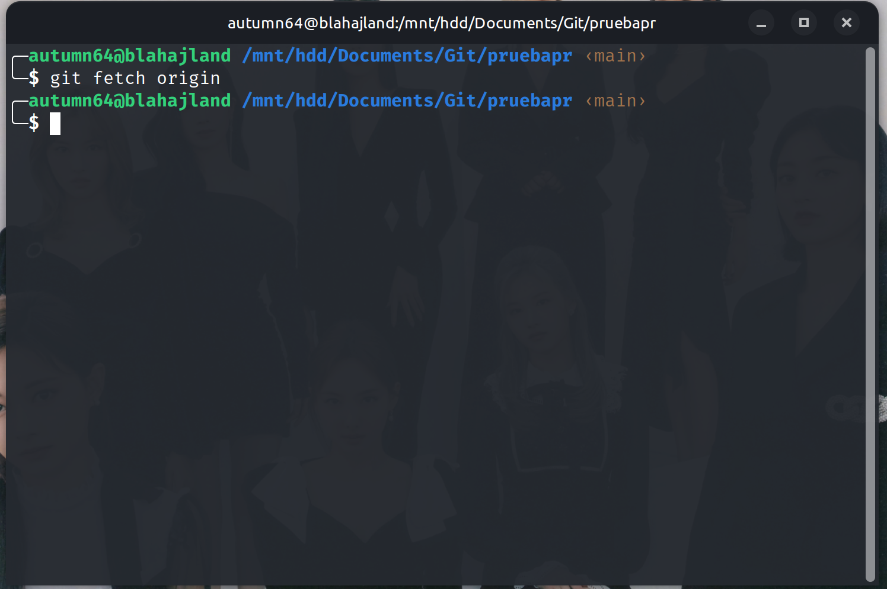

Opcionalmente podemos actualizar la rama `main` de nuestro repositorio local mediante `git pull origin main`:

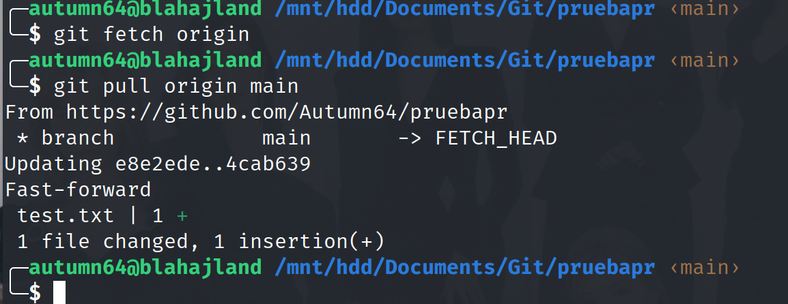

Al trabajar con un repositorio remoto, `push` significa que nosotros enviaremos lo que tenemos en nuestro repositorio local, mientras que `pull` significa que _recibiremos_ lo que está de forma remota. Podríamos entender a `push` como _subir_ y a `pull` como descargar, si bien no son lo mismo.

Después de hacer `pull`, si comparamos los archivos que hay en GitHub y en nuestro repositorio local veremos que son exactamente iguales; _están sincronizados_.

Para cambiarnos de rama lo hacemos mediante `git checkout <nombre de rama>`. Por ejemplo, si me quiero cambiar a la rama `develop`:

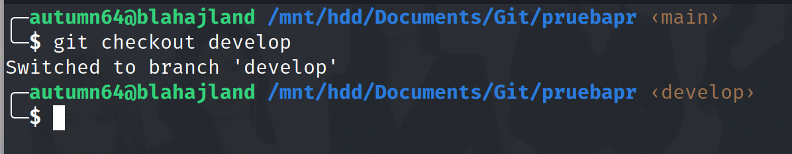

Nos daremos cuenta de que los archivos de nuestra carpeta cambiaron. Es relativamente normal que cada rama tenga archivos diferentes, por lo que, cuando cambiemos de rama desde git, los archivos que veamos en la carpeta reflejarán a los que están en esa rama del repositorio remoto.

El comando `git checkout` tira error si la rama en cuestión no existe. Yo me aseguraré de que todas las ramas existan para que no tengamos problema. La estructura de las ramas y su función será la siguiente:

- `main`: Rama principal del proyecto. Sólo debe contener el código que está listo para producción. Es decir, aquí no vamos a poner ABSOLUTAMENTE NADA hasta que el proyecto esté terminado y que ya sea lo que vamos a presentar. En tanto no lleguemos a ese punto no vamos a poner **nada** en la rama `main`.

- `develop`: Rama en la que juntaremos el código que ya testeamos y que comprobamos que funciona. No aplicaremos los cambios directamente aquí, sino que lo haremos mediante [PR](#hacer-un-pull-request).

- `feature`: Aquí estarán las ramas individuales de cada uno de nosotros, las cuales serán:

    - `moni-devel`: Donde trabajará Mónica, que se encarga del frontend y del diseño de la base de datos y supervisa el desarrollo del backend.
    - `axel-sql`: Donde trabajará Axel, que se encarga de efectuar las consultas SQL desde Flask.
    - `archer-endpoints`: Donde trabajará Archer, que se encarga de exponer la API mediante endpoints y formular las respuestas en JSON.

Eso significa entonces que, si yo Mónica me quiero cambiar a mi rama para trabajar, el comando sería el siguiente:

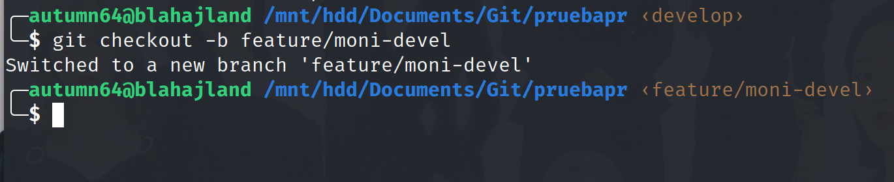

El parámetro `-b` que puse es para que no me tirara error, puesto que la rama aún no existe. Con las ramas ya existentes no es necesario ponerlo.

Antes de ponernos a trabajar, primero debemos sincronizar los cambios hechos en `devel` para tomarlos en cuenta al momento de agregar más código. Para eso usamos los comandos `git fetch origin` y `git rebase origin/develop`:

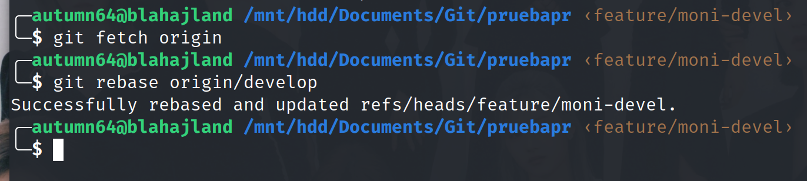

A partir de aquí, podemos abrir la carpeta del proyecto en VS Code o en lo que queramos, y empezar a trabajar.

**Siempre hay que cuidar que estamos trabajando en nuestra rama, para evitar hacer un desorden en el repositorio.**

## Crear un commit

Supongamos que ya hicimos los cambios que teníamos pensado, ya los probamos y ya vimos que funcionan. Ahora toca aplicar los cambios. Para eso se hace lo que en Git se llama "_commit_", que es análogo a que si sacáramos una captura de pantalla del código en ese momento. Los commits no solamente nos permiten aplicar nuestros cambios de una manera ordenada, sino que también nos ayudan a tener un historial de los cambios que se han realizado y quién los ha hecho.

Para hacer un commit, primero debemos indicarle a Git que tome en cuenta a nuestros archivos. Para esto usamos el comando `git add .`. Después, si ejecutamos el comando `git status` veremos exactamente qué cambios se van a aplicar:

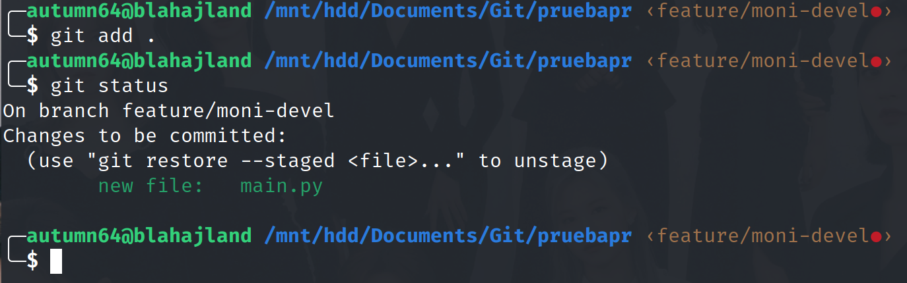

Tomen en cuenta que si después de esto modifican un archivo porque algo se les olvidó, es mejor volver a hacer `git add .`.

Fíjense que en la captura dice "On branch `feature/moni-devel`", que esa es mi rama. Si dijera `develop` o, peor aún, `main`, entonces ya nos equivocamos de rama. JA q menso se equivocó /j.

Pero, ¡que no panda el cúnico! Nuestra burrada tiene solución. Simplemente ejecutamos `git reset`, y con ello vamos a deshacer los cambios, entonces nos cambiamos a nuestra rama con `git checkout`, y ahora sí podemos ejecutar `git add .` sin miedo. Si al momento de cambiar de rama les tira error o les manda un mensaje de que se van a sobreescribir los archivos (y por favor LEAN y PRESTEN ATENCIÓN a los mensajes que pueda mandar Git), lo mejor es que me pidan ayuda por mensaje.

Ya teniendo todo listo para aplicar nuestros cambios, simplemente basta con hacer nuestro commit con el comando `git commit -m "<mensaje>"`. Los commits deben tener un mensaje que, si bien no hay una regla de qué debería decir, mi recomendación es que ahí pongan una descripción muy breve de lo que hicieron o de por qué hacen el commit. Eviten usar signos de exclamación o interrogación, acentos o cosas que no sean letras y números en el mensaje, ya que Git se puede poner de payaso y no leerlo correctamente.

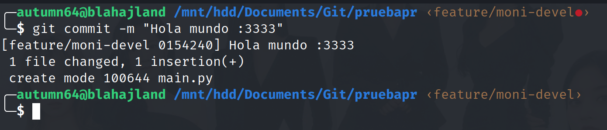

Y con esto ya le sacamos captura a nuestro código. Podemos seguir trabajando si queremos, en cuyo caso toca repetir el mismo procedimiento de `git add .` -> `git status` -> `git commit`, y podemos hacer cuantos commits queramos.

Les sugiero que cuiden que sus commits no sean demasiado grandes. Saben que leer código es pesado y tardado, y si me hacen un commit con todo el código de la Apollo 11 los voy a m... /j. Ustedes consideren cuándo ya deberían de hacer un commit; si ven que ya fue mucho quizás sea buena idea hacerlo, o quizás les parezca mejor seccionarlo de antemano de modo que un commit corresponda a una sección que ya implementaron. Hay que buscar el balance entre no llenar con 80 mil cuatrillones de commits miniatura y no hacer un solo commit con 450 mil decallones de archivos modificados y 15 [gúgoles](https://es.wikipedia.org/wiki/G%C3%BAgol) de líneas de código. ¿Cuántas veces ya he dicho "commit"?

Podemos seguir haciendo cuantos commits queramos (y dale con decir "commit" otra vez), pero recordemos que los cambios no se verán reflejados en GitHub hasta que hagamos `push`, entonces ahora haremos eso mediante el comando `git push origin <rama>`:

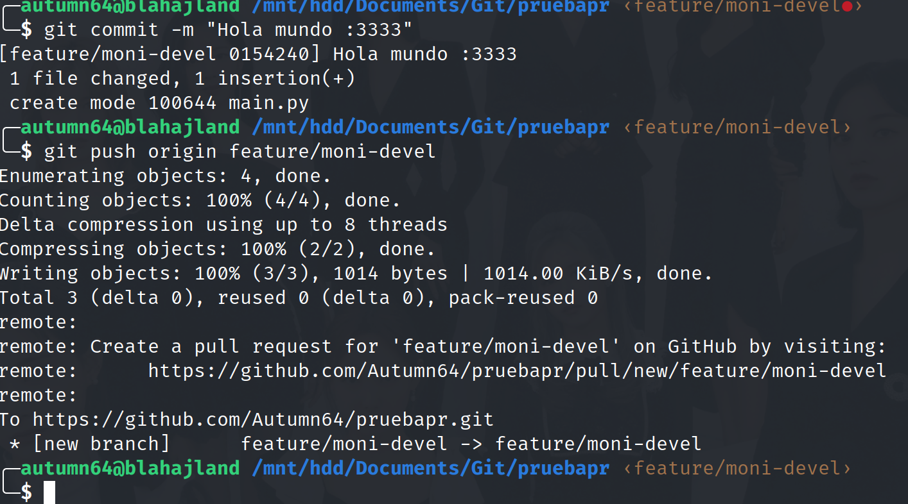

Si llegase a tirar error o algo, hay que prestar atención y ver cómo solucionarlo o, en su defecto, pedirme ayuda. Ahora, si revisamos en GitHub, veremos que nuestros cambios ya están aplicados:

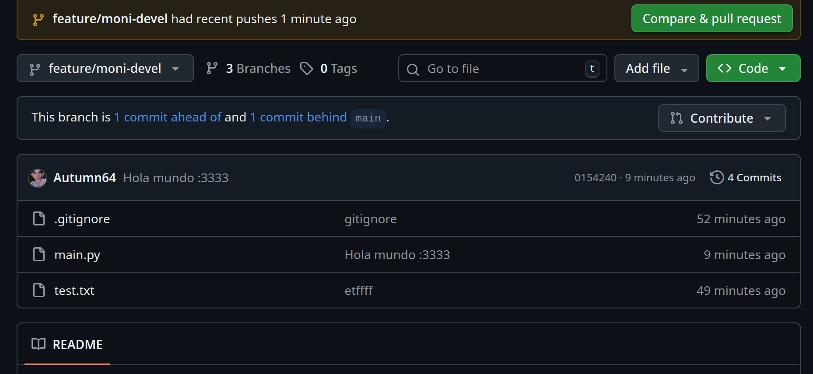

Dado que es sobre nuestra rama, no es necesario que avisemos a los demás sobre estos cambios, y también tenemos la libertad de ir a nuestro ritmo.

Les recomiendo que hagan `push` por cada 2 o 3 commits. Si dejan que se vayan juntando y si se acumulan muchos, al momento intentar hacer `push` su computadora y su internet van a sufrir, y para qué queremos eso, y hacer un `push` por cada commit me parece un poco innecesario a menos que ya no vayamos a seguir trabajando.

Ya que hicimos las suficientes pruebas, que comprobamos que todo funciona como debe, y que nos sentimos moralmente listos para verle la cara al lobo, tocó proponer nuestros cambios para juntarlos con la base principal del código: con la rama `develop`. ¡Qué miedo, pero qué emoción!

## Hacer una Pull Request

Normalmente, cuando queremos aplicar los cambios que hicimos en una rama distinta, usamos el comando `git merge`. Sin embargo, por esta ocasión prescindiremos de eso ya que, si no lo sabemos usar bien, todo se nos va a volver un caos. Por ello, existen otras maneras de "_proponer_" los cambios que hicimos para que, si los demás están de acuerdo, entonces ahora sí se apliquen a la rama principal del proyecto.

En algunas plataformas de hosting de Git, como Savannah y otros, la manera en la que se hace (o hacía) era mediante parches. Ahora, con plataformas más modernas como GitHub, Gitea o Forgejo (en esta última se encuentra Codeberg) se estila hacer lo que se conoce como *Pull Request*. Esta PR se hace desde Internet y sirve para _proponer_ nuestros cambios, y se habilita un espacio en la que los colaboradores del proyecto pueden revisarlos, discutirlos y, al final, aceptarlos o rechazarlos.

Desaconsejo totalmente hacer una Pull Request por cada commit que hagamos, y también desaconsejo hacerlo si aún no hemos terminado lo que teníamos pensado implementar. La idea de la PR es que nosotros ya lo probamos y ya vimos que funciona correctamente (y que no nos va a borrar toda la base de datos), y evitar que suceda que todavía ni lo probamos y capaz hasta hace que la máquina explote y ahí andamos de mensos haciendo PR de manera indebida.

Para hacer una Pull Request, nos vamos a la interfaz de GitHub, seleccionamos el apartado "Pull Requests", y damos al botón de crear nueva PR:

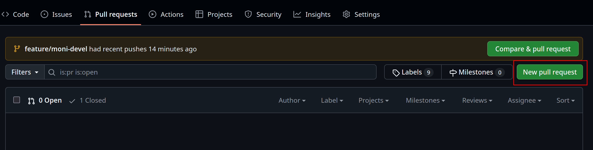

Después nos van a aparecer dos parámetros: uno dice `base`, y el otro dice `compare`.

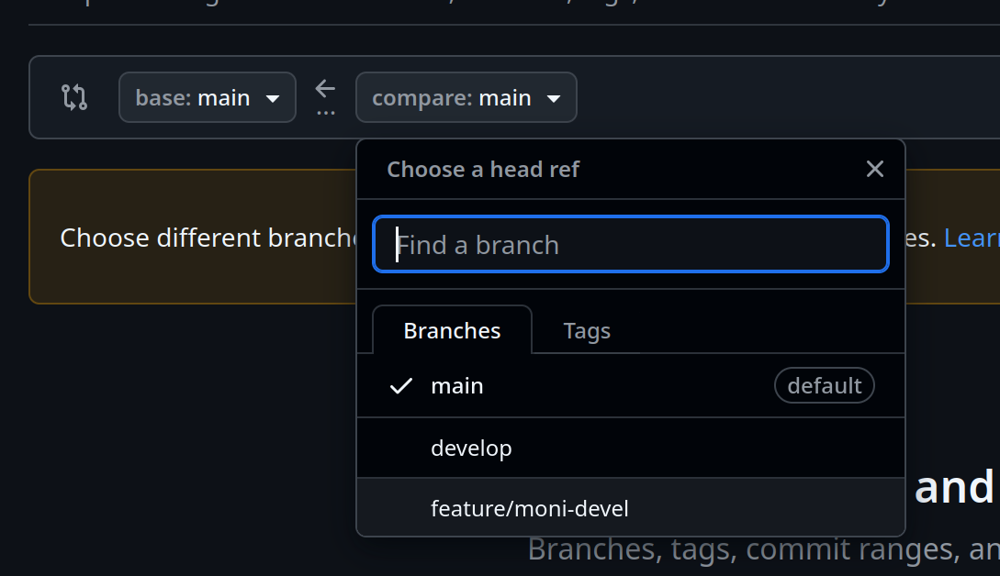

`base` es la rama **a la que le queremos aplicar los cambios**, mientras que `compare` es la rama **que tiene los cambios que queremos aplicar, o sea la nuestra**. Es importantísimo que escojamos la rama `develop` para aplicar los cambios ahí, **no** la de `main`. Si hacen PR directo en `main`, con mucho dolor y tristeza su PR va a ser rechazada.

Ya que nos aseguramos de que escogimos bien las ramas, entonces nos van a aparecer los commits que están presentes en GitHub. Hay que revisar que esté actualizado porque capaz que nos faltó hacer `push` de algún commit, y entonces no se ve reflejado y estaríamos haciendo una PR incompleta.

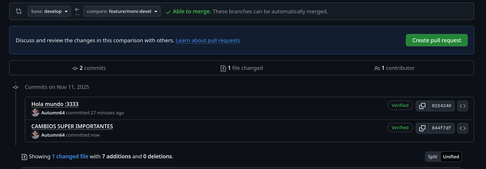

Ya que vimos que todo está en orden, entonces damos al botón para crear la Pull Request. Ahora podremos ponerle un título y una descripción. Es buena idea describir de forma no muy extensa qué cambios hicimos y de qué forma lo hicimos, más consideraciones que se deberían tomar en cuenta para la PR. También podemos agregar imágenes o archivos si es necesario. 

Habiendo hecho eso, damos al botón de crear y con ello habremos terminado.

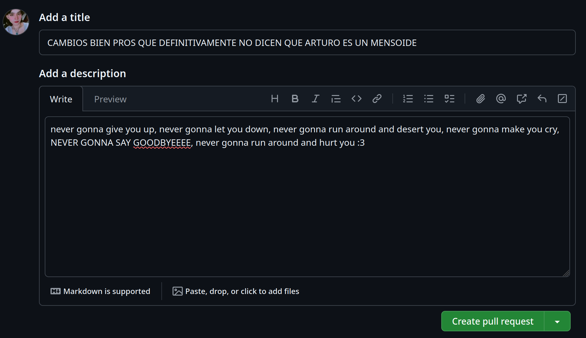

Recomiendo avisar a los demás "holi hice una PR con mis cambios de tal cosa lo revisan porfi :DDDD". Más que nada para que no se nos vayan acumulando y termine siendo agobiante.

Ahora, si revisamos el apartado de Pull Requests de GitHub, veremos ahí nuestra preciosa y recién nacida PR.

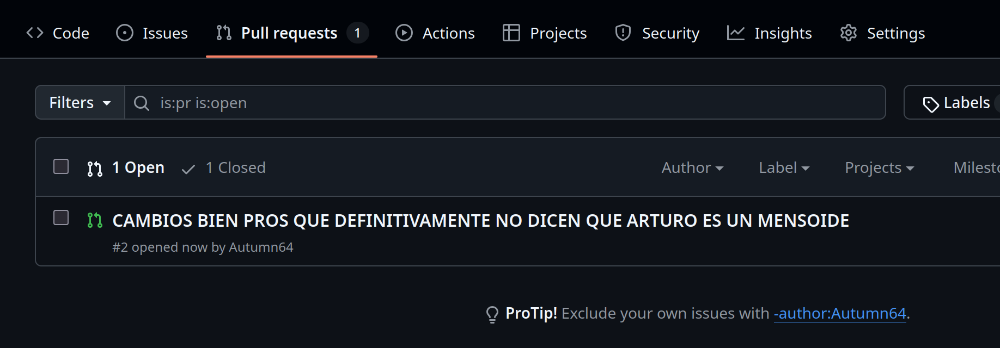

Ahora, si damos click en ella, podremos ver a detalle todos los cambios que estamos proponiendo. El primer apartado, que es el de "Conversación", es en donde los colaboradores pueden hacer preguntas, observaciones, y en general discutir la PR. La idea es que se llegue a un acuerdo entre todos (en este caso nosotros 3) para aceptarla o rechazarla.

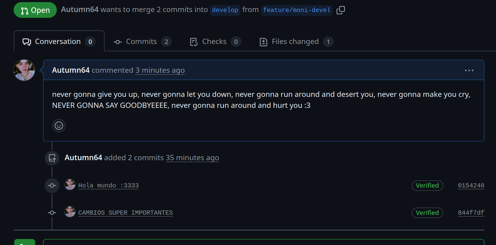

En el segundo apartado, que es el de "Commits", podremos ver a detalle las modificaciones que se han hecho al código.

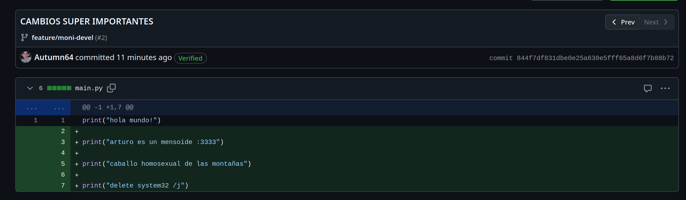

Si se rechaza nuestra PR se nos especifica la razón, y entonces podemos simplemente seguir trabajando, arreglar lo que se nos indique y volver a intentarlo, que no es el fin del mundo y no pasa nada :3.

Si se aceptó la PR, no debemos olvidarnos de actualizar nuestro repositorio local antes de ponernos a trabajar, para tener los últimos cambios y saber sobre qué vamos a continuar trabajando.

## Conflictos entre el repositorio remoto y el local

Resulta que mientras aceptaron nuestra PR con flores, aromas bonitos y colores, alguien más (en este caso mi alter-ego... supongo...) estaba trabajando en exactamente el mismo archivo que yo modifiqué. Como esta otra colaboradora le sabe y es bien pro no se olvida de actualizar su repositorio local _antes_ de trabajar y también al momento de hacer el commit que va a incluir en la PR. 

Recordemos que actualizamos nuestro repositorio local con `git fetch origin` y `git rebase origin/develop`:

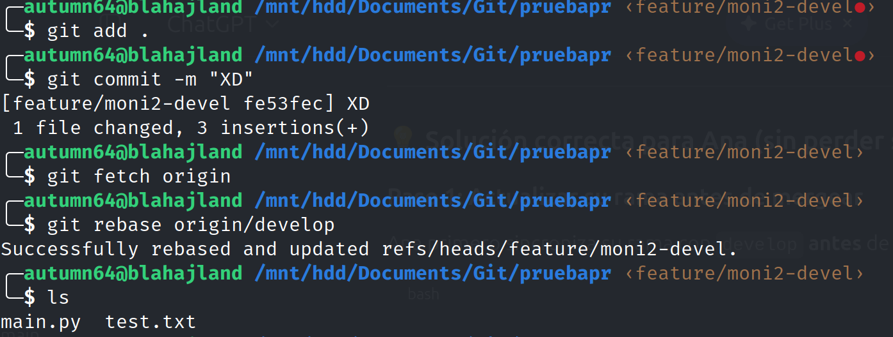

En este caso no hubo problema porque se alteraron secciones diferentes del archivo, además de que, como el repositorio ya estaba actualizado de antemano, prácticamente no se generó ningún conflicto. Entonces, como no tiró error de nada, podemos seguir trabajando sin problema y no pasa nada si hace `push` y si se intenta hacer una PR.

Sin embargo, ahora mi otra alter-ego (supongo...), que no le sabe y que no es pro (ja q noob) no actualizó su repositorio antes de empezar a trabajar, y acaba de hacer esta barbaridad:

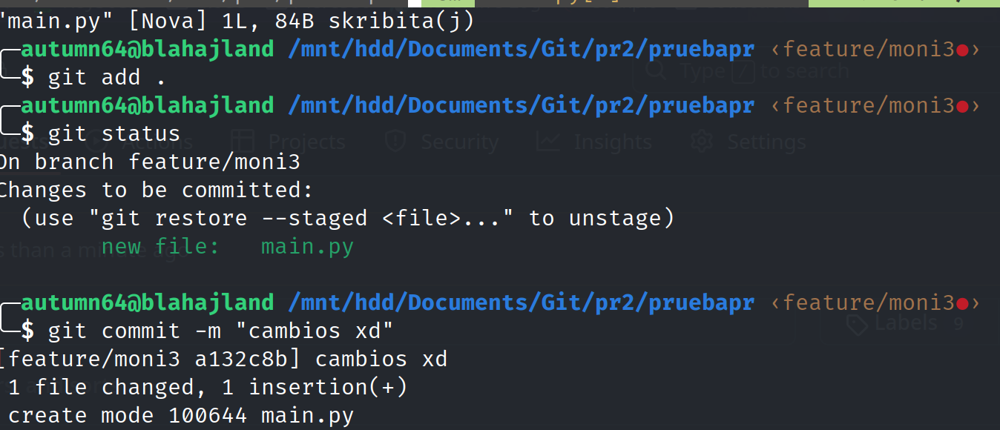

Literalmente está creando un archivo `main.py` distinto, porque como no actualizó su repositorio entonces a ella no le apareció, e ignoró completamente que en el repositorio remoto ya hay un archivo con el mismo nombre.

De último minuto nuestra queridísima noob se acordó de que no actualizó su repositorio, y al intentar hacerlo le apareció esto:


Aquí puede irse por 2 caminos:

1. Tratar de solucionar manualmente el problema.
2. Borrar el archivo que creó o ignorar el commit que hizo, perdiendo los cambios que ella hizo.

Nuestra amiga noob no es sacatona y decide enfrentarse al archivo. Lo abre y ve lo siguiente:

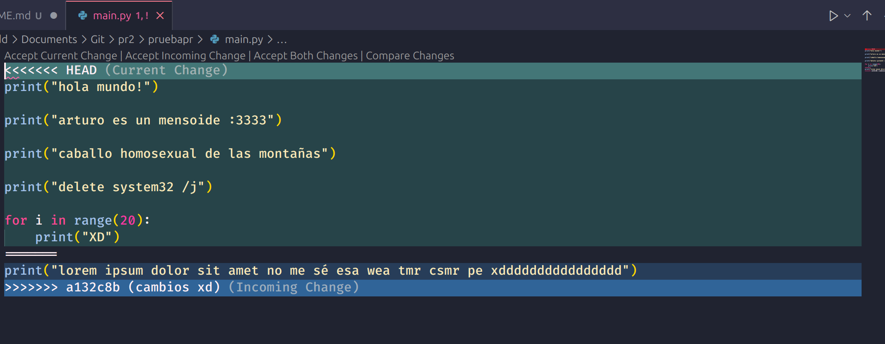

Entonces, trata de acomodar los cambios a como los ve pertinentes, porque será descuidada y tonta y estúpida pero no es mensa, y le queda así:

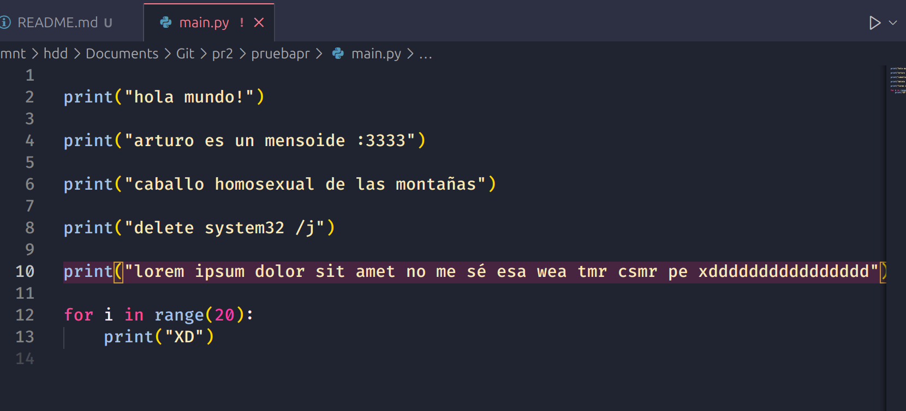

Entonces vuelve a intentarlo, esta vez Git la cuestiona de por qué está aplicando estos cambios, pero ella no tiene miedo y sabe que no tiene nada de malo equivocarse; así que pone el siguiente mensaje:

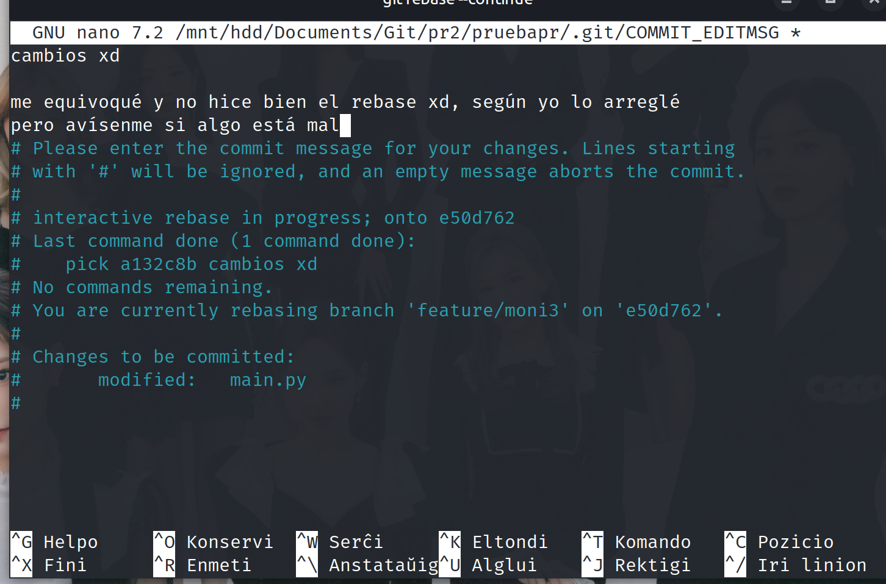

Y, para su fortuna, todo salió bien. Dado que se puso muy nerviosa por toda esta situación, decidió simplemente hacer `push` de los cambios que hizo en su propia rama, y tomarse el resto del día para descansar; ya mañana le sigue, y tendrá más cuidado para la próxima:

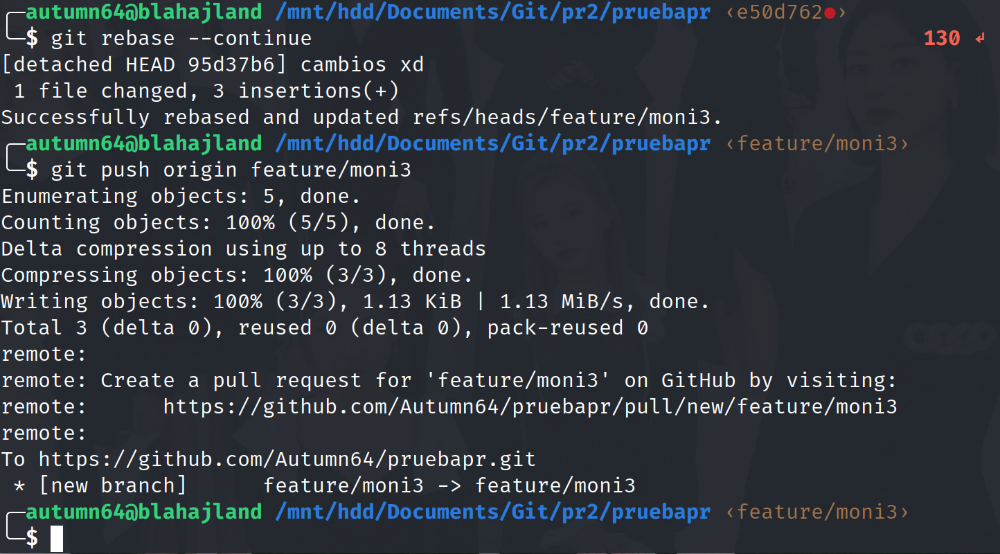

## Conclusión

Como podemos observar, Git es un reverendo despapaye. Sin embargo, la misma herramienta te da opciones para que, si te equivocas, no sea el fin del mundo para ti, además de que las Pull Request de GitHub son buenísimas no sólo para revisar cambios, sino también para discutirlos y llegar a acuerdos en el equipo.

Espero que esta guía les sea de ayuda para cuando ya tengan que enfrentarse a esto de verdad &mdash; realmente no es difícil, simplemente son muchas cosas las que hay que recordar, y al final la práctica es la que nos va a permitir acostumbrarnos a esto.

No olviden mis recomendaciones, que las vuelvo a listar de manera resumida por si se les olvidaron:

- Tengan la costumbre de actualizar el repositorio local en la rama de ustedes ANTES de ponerse a chambear. Si se les olvidó, háganlo en cuanto lo recuerden, y si Git les marca que hay archivos en conflicto hagan lo que les mostré en esta guía.

- Busquen el balance commits-push. Es pesado llenar un mismo push con 450 mil commits chiquitos, y es aún más pesado subir un único commit con 267 mil archivos editados y 8 trillones de líneas de código.

- Si van a hacer PR, háganla sobre la rama `develop`, NO sobre la rama `main`.

- Debemos estar en constante comunicación por mensaje para asegurarnos de que todo esté en orden y evitar que el repositorio se vuelva un caos.

- Con cualquier duda que tengan, o con cualquier cosa en la que se atoren, **no duden en preguntarme**. Pueden buscar en Internet si quieren; eso también sirve. Pero si no ven forma de avanzar, no sirve de nada estar 6 horas intentándole sin ver ningún resultado &mdash; mejor ahórrense ese estrés y ese tiempo perdido y pidan ayuda :3.